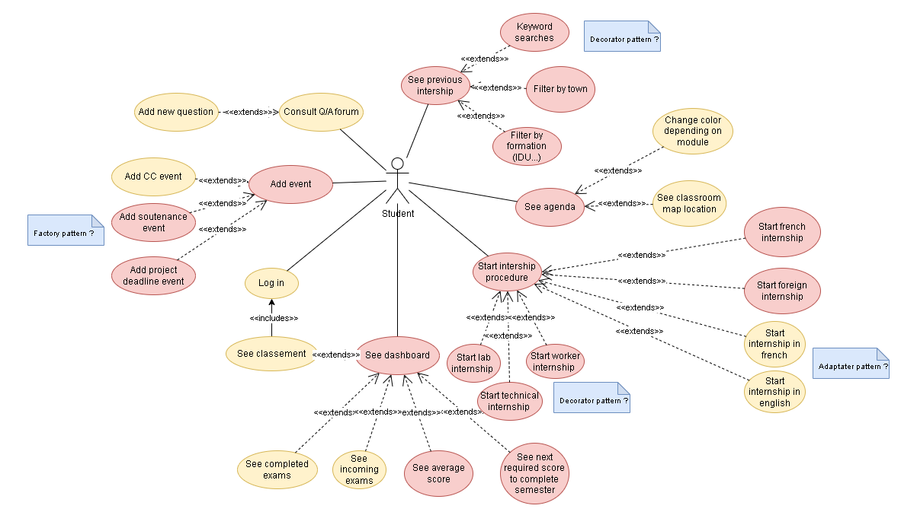

# INFO 732 – Application pour les étudiants
Objectif pédagogique : ce mini-projet est axé sur la conception et réalisation d’un système informatique avec prise en compte des aspects qualité liés au logiciel.

## Problème choisi: Dashboard étudiant
Vous devez concevoir une application destinée a aider les étudiants dans leur apprentissage, en leur fournissant (éventuellement à travers un tableau de bord ) des informations pouvant leur être utiles, telles que l’avancement temporel des enseignements, travaux à rendre, niveau de charge de la semaine, situation dans la promo (notes par rapport aux moyennes), etc. Ce type d’application fait partie de ce qu’on appelle Learning Analytics, notamment Student Dashboard. On vous demande de proposer une application regroupant les fonctionnalités qui vous semblent le plus pertinentes. 

## Proposition de fonctionnalités:
* Planning pour trouver les salles (voir iCal4j API Google Agenda)
* Forum Q/A
* Messagerie
* Archives avec faux uploads et faux download (voir API google, fichiers prof)
* Hyperliens vers services Polytech
* Recherche de stage (Utilisation Excel)
* Interfaces

## Use Case Diagramme: 

## Librairie a installé:
-biweekly http://search.maven.org/remotecontent?filepath=net/sf/biweekly/biweekly/0.6.7/biweekly-0.6.7.jar
